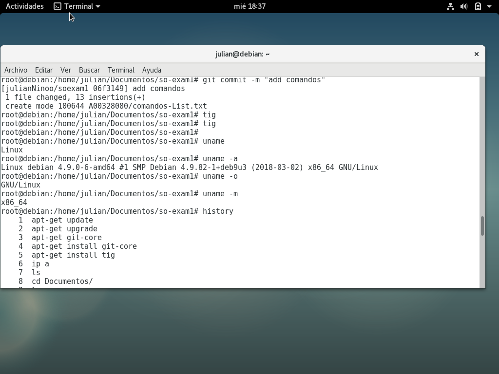

 

## Primer Examen Parcial 

 Nombre: Julián Niño  
 Código: A00328080  
 Materia: Sistemas Operativos  
 Correo Electronico : julian.nino@correo.icesi.edu.co


 ## Descripción 

En este nuevo repositorio se podrá ver el Primer examen parcial de sistemas operativos , en el cual se instala una imagen del sistema operativo  Debian en Virtual Box tambien la configuracion de mtPutty y de Putty.  

El repositorio antes mencionado se encontrará en este link: https://github.com/julianNinoo/so-exam1.git  

La lista de comandos empleados en este parcial se encontrará en  > comandos-List.txt

 
## Tercer Punto

-Se descargó MD5 del sigiente link http://download.cnet.com/MD5-SHA-Checksum-Utility/3001-2092_4-10911445.html  
-Para obtener el checksum que debemos verificar se ingresa al siguiente link : http://cdimage.debian.org/debian-cd/current/amd64/iso-cd/MD5SUMS ( prueba de esto se4 encuentra en una imagen , abajo ) 
- Se ingresa en el campo  y se hace la respetectiva verificación 

Link de la verificación:  


  


Verificación:   

  


## Cuarto Punto 
Se da click en nueva en la Virtual Box, el nombre  se le da como Debian9, el tamaño de memoria no se cambió es decir que esta en 1024 MB, esto creará un disco virtual , se configuran las interfaces de red para la maquina virtual despues de esto se configuró el super usuario ,el idioma y se procede a esperar varias horas para la instalación del sistema operativo.  

En los siguientes comandos se puede ver la información del sistema 


``` 
julian@debian:~/Documentos$ uname
Linux
```
```
julian@debian:~/Documentos$ uname -a
Linux debian 4.9.0-6-amd64 #1 SMP Debian 4.9.82-1+deb9u3 (2018-03-02) x86_64 GNU/Linux
```
```
julian@debian:~/Documentos$ uname -o
GNU/Linux
```
```
julian@debian:~/Documentos$ uname -m
x86_64
```
Imagen de los comandos en esta maquina virtual
 


